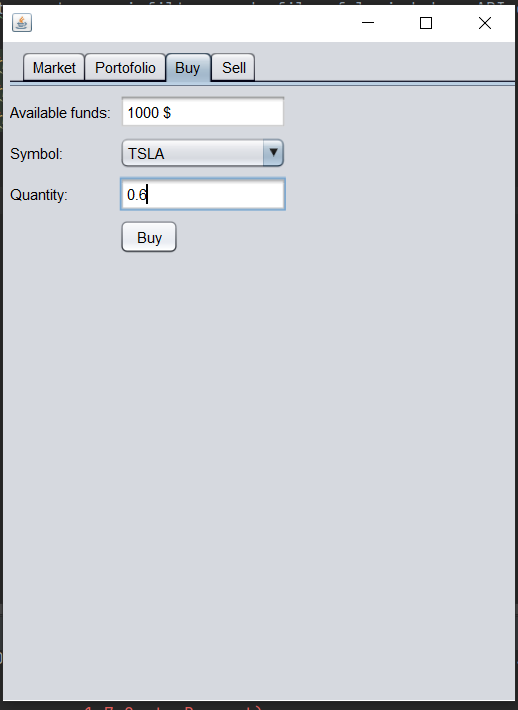

# Trading Platform

In this project I developed a stock trading application using Java and NetBeans Design View for generating the graphical user interface. It has fully functional buying and selling features, a market offer page and a portfolio page.

